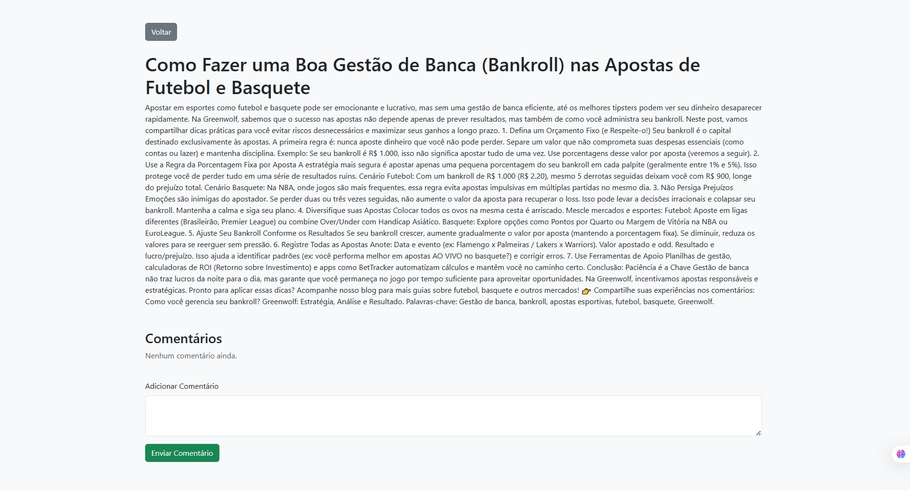

# Blog Greenwolf App - Hands-on com Docker e Azure

Este projeto foi desenvolvido durante o curso ministrado pelo professor **Henrique Eduardo Souza**, onde aprendemos a criar e publicar uma aplicação web utilizando **Docker** e **Azure Container Apps**. A aplicação consiste em um blog simples com funcionalidades de criação, visualização e comentários em posts.

## Estrutura do Projeto

A aplicação é composta por arquivos HTML que implementam as páginas do blog, incluindo:
- `index.html`: Lista de posts.
- `create-post.html`: Página para criar novos posts.
- `post-detail.html`: Página para visualizar detalhes de um post e adicionar comentários.

Além disso, o projeto inclui um `Dockerfile` para criar a imagem Docker da aplicação e o script `scripts.ps1` com os comandos necessários para configurar e publicar a aplicação no Azure.

## Passo a Passo

### 1. Configuração do Ambiente
O professor explicou como configurar o ambiente local para rodar a aplicação:
- Criamos um **Dockerfile** para empacotar os arquivos HTML em uma imagem baseada no **Nginx**.
- Utilizamos o comando `docker build` para criar a imagem e `docker run` para rodar o container localmente.

### 2. Publicação no Azure
Seguindo o script `scripts.ps1`, realizamos os seguintes passos:
1. Criamos um **Resource Group** no Azure.
2. Configuramos um **Azure Container Registry (ACR)** para armazenar a imagem Docker.
3. Publicamos a imagem no ACR utilizando os comandos `docker tag` e `docker push`.
4. Criamos um ambiente para o **Azure Container App** e configuramos a aplicação para rodar no Azure.

### 3. Testes e Resultados
Após a publicação, testamos a aplicação:
- Acessamos o blog no navegador para verificar as funcionalidades.
- Validamos a criação de posts, exibição de detalhes e adição de comentários.

### Prints do Processo
Abaixo estão alguns prints que ilustram o processo e os resultados:

1. **Aplicação rodando localmente no Docker:**
   

2. **Publicação no Azure Portal:**
   

3. **Aplicação rodando no navegador após publicação:**
   
   
   
   

### Insights e Possibilidades

Durante o curso, aprendi algumas lições importantes:
- **Automação com GitHub Copilot:** Utilizar o Copilot para tarefas repetitivas, como escrever scripts de publicação (`scripts.ps1`), aumenta significativamente a produtividade.
- **Integração com Azure:** O Azure Container Apps é uma solução poderosa para hospedar aplicações em containers com escalabilidade automática.
- **Uso de LocalStorage:** A aplicação utiliza o `localStorage` do navegador para armazenar posts e comentários, o que é uma solução simples e eficaz para protótipos.

### Possibilidades Futuras
- **Persistência de Dados:** Substituir o `localStorage` por um banco de dados real, como Azure Cosmos DB.
- **CI/CD:** Configurar pipelines de integração e entrega contínua para automatizar o processo de build e deploy.
- **Escalabilidade:** Explorar configurações avançadas de escalabilidade no Azure Container Apps.

---

Este projeto foi uma excelente oportunidade para aprender conceitos práticos de Docker e Azure, além de explorar como ferramentas como o GitHub Copilot podem acelerar o desenvolvimento.